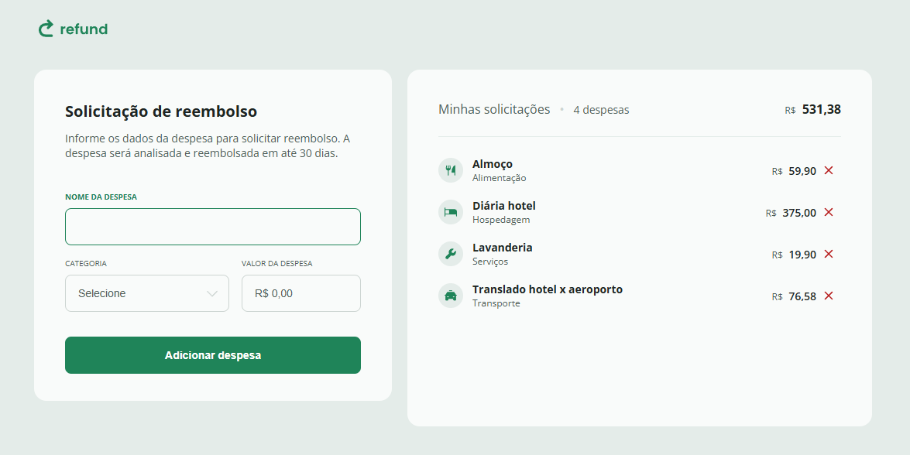

# 📦 Refund

Um projeto em **JavaScript** que simula um criador de pedidos de reembolso.  
Com ele, é possível **adicionar e remover itens** de uma lista, visualizar a **quantidade total de itens** e o **valor total a ser reembolsado**.

Este projeto foi desenvolvido durante o curso **Full Stack da Rocketseat** e faz parte do meu portfólio de desenvolvedor web.

---

## 🚀 Demonstração

> 🔗 [Acesse o projeto online](https://devwebfelipe.github.io/Refund/)



---

## ✨ Funcionalidades

- ➕ **Adicionar novos itens** à lista de reembolso
- ➖ **Remover itens** já adicionados
- 📊 Exibir **quantidade total de itens**
- 💰 Exibir **valor total dos reembolsos**
- 🎨 Interface simples e intuitiva

---

## 🛠️ Tecnologias Utilizadas

- **HTML5**
- **CSS3**
- **JavaScript (ES6+)**

---

## 📂 Estrutura do Projeto

```bash
Refund/
│── index.html      # Estrutura principal da aplicação
│── style.css       # Estilos da interface
│── script.js       # Lógica de funcionamento
│── README.md       # Documentação do projeto
```

---

## ⚙️ Como Executar o Projeto Localmente

1. Clone este repositório:

   ```bash
   git clone https://github.com/DevWebFelipe/Refund.git
   ```

2. Acesse a pasta do projeto:

   ```bash
   cd Refund
   ```

3. Abra o arquivo `index.html` no navegador de sua preferência.

Pronto! 🎉

---

## 🤝 Contribuições

Contribuições são sempre bem-vindas!  
Sinta-se à vontade para abrir **issues** ou enviar **pull requests**.

---

## 👨‍💻 Autor

**Felipe Texeira**  
📧 E-mail: [felipe.flptxr@gmail.com](mailto:felipe.flptxr@gmail.com)  
💼 LinkedIn: [linkedin.com/in/felipe-teixeira-460464110](https://www.linkedin.com/in/felipe-teixeira-460464110/)  
🐙 GitHub: [github.com/DevWebFelipe](https://github.com/DevWebFelipe)  
🌐 Portfólio: [devfelipe.netlify.app](https://devwebfelipe.github.io/PortifolioDev/)

---

⭐ Se você gostou deste projeto, não esqueça de deixar uma **estrela** no repositório!
